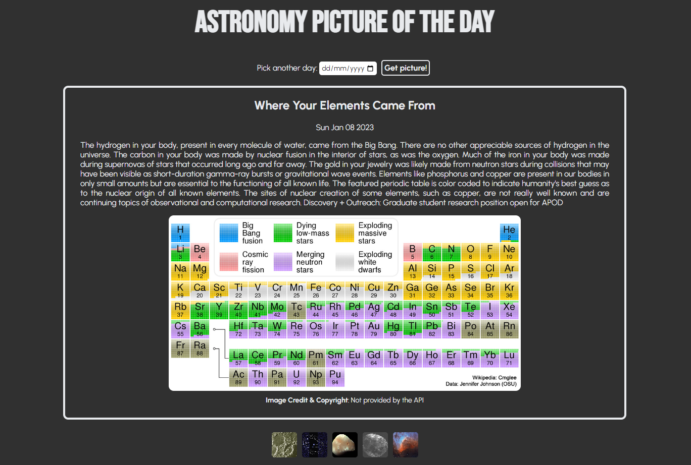

# Astronomy Picture of the Day (APOD)

This app shows astronomical images provided by [NASA's API](https://github.com/nasa/apod-api). The academic goal was to train API calls through `fetch`. For more info concerning APOD, please check the official [webpage](https://apod.nasa.gov/apod/astropix.html). Below you can see a snapshot of the app and check its main functionalities.

## Functionalities available

### Check out the Astronomy Picture of the Day!

When the page is loaded, you can automatically check out today's picture jointly with a brief explanatory on top of it. You can also consult credits and copyright info just below the image.

### Want to review some old APODs?

We got your back! Right below the title, you have a data input where you can select a date to revisit an old APOD to share with your friends. After selecting a date, just click on "Get picture!".

### Feeling random today?

Check this out! If you want to check some randoms APODs, no problem. Just go to the bottom of the page and select one of the five images displayed. You just need to click on them _et voilà_!
